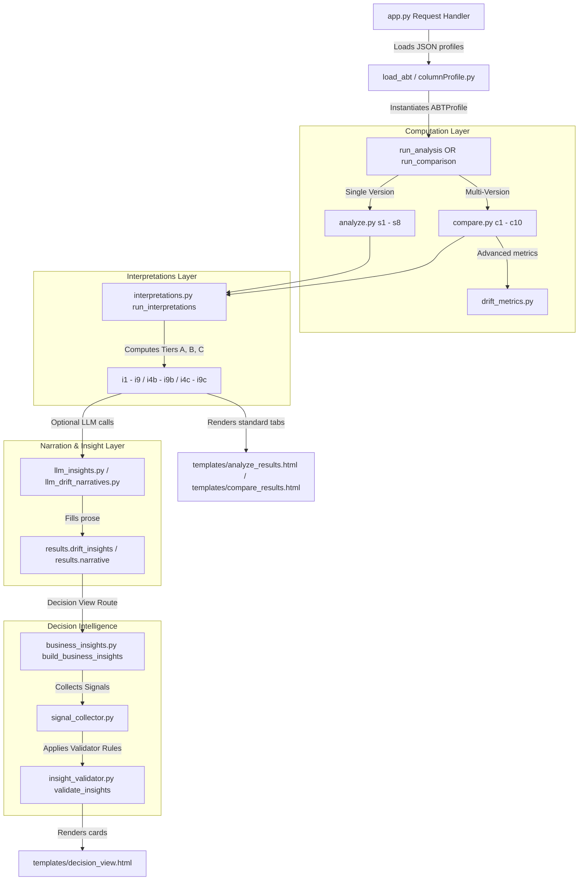

# EDA Service — Exploratory Data Analysis

RMEDA is a Flask web application designed for Risk Modeling teams to ingest, analyze, and compare consecutive versions of **Analytic Base Tables (ABT)**. It evaluates data quality, features usability, target stability, and drift metrics using both rule-based algorithms (Tier A), hybrid validators (Tier C), and LLM-powered narrative insights (Tier B).

---

## 1. Quick Start & Setup

The project configuration is decoupled from the code. Local settings are loaded from a `.env` file at startup.

### Automated Setup & Launch (Windows)
We provide universal runner scripts to automatically check/create a virtual environment, install requirements, and run the app.

#### PowerShell:
1. Open PowerShell in this directory.
2. Run:
   ```powershell
   .\run.ps1
   ```
3. If this is the first run, the script will copy `.env.example` to `.env` and pause. **Open `.env` and fill in your Azure OpenAI and SAS IC credentials**, then re-run the script.

#### Double-click Option:
* You can also double-click **`run.bat`** in Windows Explorer. It will launch the PowerShell runner in a command window.

### Manual Setup
If you prefer to run the setup commands manually:
1. Create a virtual environment:
   ```bash
   python -m venv venv
   ```
2. Activate the environment:
   * Windows: `venv\Scripts\activate`
   * Linux/macOS: `source venv/bin/activate`
3. Install dependencies:
   ```bash
   pip install -r requirements.txt
   ```
4. Copy `.env.example` to `.env` and configure your keys.
5. Launch the application:
   ```bash
   python app.py
   ```
The app will run locally on `http://127.0.0.1:5000/`.

---

## 2. Environment Variables Configuration

Configure these parameters in your local `.env` file:

| Variable | Description |
| :--- | :--- |
| `IC_BASE_URL` | The base URL of the SAS Information Catalog (IC) API. |
| `IC_ACCESS_TOKEN` | Bearer token used to authenticate with the SAS IC API. |
| `AZURE_OPENAI_ENDPOINT` | The endpoint URL for your Azure OpenAI instance. |
| `AZURE_OPENAI_KEY` | The API Key for Azure OpenAI. |
| `AZURE_OPENAI_DEPLOYMENT` | The model deployment name (defaults to `gpt-4o`). |

---

## 3. UI-to-Code Section Mapping

Here is how the four key backend files map to the results dashboards:

### A. `insights.py`
This module computes core metrics and scoring for individual datasets.
* **Single Version Headline Readiness Score (S0)**: Computes the 0–100 overall score on the Single Version Analysis page.
* **Column Health Scores (S8)**: Computes the grid of individual 0-100 column-level scores.
* **Prioritized Action List (S9)**: Ranks recommended data fixes based on severity and modeling impact.
* **PSI Matrix (C8)**: Computes the baseline Population Stability Index values used on the Version Comparison Page.

### B. `insight_validator.py`
Processes the business insight cards before rendering.
* **Validation Layer**: Runs Pass 1 (Hard Rules) and Pass 2 (LLM Review) on the 7 business cards shown in the **Decision View**.
* **UI Warnings**: Appends warning/downgrade notes that render as `⚠ Validator: [Warning Detail]` inside the Decision View card UI.

### C. `business_insights.py`
Compiles executive summaries for risk management review.
* **Phase 1: 7 Business Cards**: Generates headlines, evidence data, and actions for the cards shown on the **Decision View Page**.
* **Dynamic Reordering**: Sorts the cards by severity to highlight critical target definitions or schema breaks.

### D. `interpretations.py`
Computes rule-based, hybrid, and LLM-narrative explanations.
* **Single Version Page**:
  * **Feature Usability Verdicts (I1)**: Suggests column actions (`use`, `fix_then_use`, `drop`, `exclude`).
  * **Training Readiness (I2)**: Suggests metrics, splitting, and resampling rules.
  * **Preprocessing Checklist (I3)**: Sequential data-prep suggestions.
* **Version Comparison Page**:
  * **Interpretations Tab (I4 - I9)**: Populates detail sections on population shift causes, event rates, feature drift, recommended model action (which also drives the overall Verdict Banner), and pipeline risk/health.

---

## 4. Code & Data Flow Architecture

The data flows from ingestion down to the web pages:


