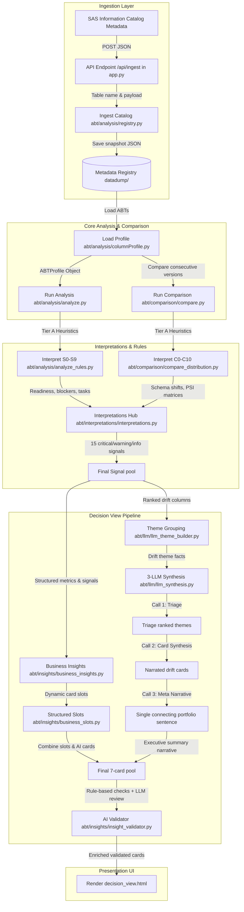
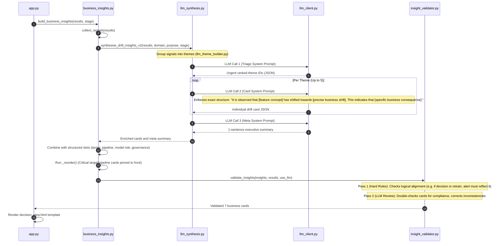
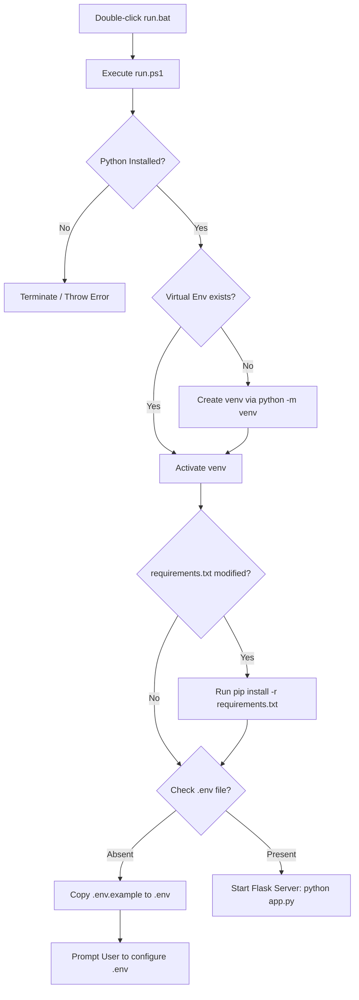

# EDA — In-Depth Data and Code Flow Diagrams

This document provides a detailed walkthrough of the final codebase architecture, mapping exactly how data flows from initial metadata ingestion to the final AI-validated Decision View cards.


---

## 1. End-to-End System Dataflow

Below is the complete data lifecycle of a table comparison.



---

## 2. Code Flow of Individual Modules

### A. Ingestion & Ingest Pipeline
1. **API Ingest**: `app.py` receives a request at `/api/ingest` containing the `table_name` and standard SAS column catalog metadata.
2. **Deterministic Versioning**: `abt/analysis/registry.py` runs `_hash_items` on the columns.
   * If the table is new, it initializes as **Version 1**.
   * If the table exists and the hash matches an existing version, it updates `last_seen` timestamp (reusing the existing version number).
   * If the table exists but the hash is different, it increments to a new version (e.g. **Version 2**).
3. **Data Storage**: Ingested JSON payloads are stored under `datadump/<safe_table_name>/v<version>.json`, and the central `registry.json` is updated.

---

### B. Single-Version Analysis Module (S0–S9)
Called via `run_analysis(abt_profile, target_col, use_llm)` in `abt/analysis/analyze.py`:

```
[Start run_analysis]
   │
   ├── s2_blockers() ──────> Evaluates critical blockers (missing target, completeness < 80%)
   ├── s3_warnings() ──────> Evaluates moderate warnings (completeness 80-95%, high skew > 2)
   ├── s4_governance() ────> Flags columns labeled 'private' in metadata
   ├── s5_readiness() ─────> Runs readiness score assertions
   ├── s8_health() ────────> Computes per-column score (100 minus severity penalty)
   ├── s0_score() ─────────> Calculates overall readiness score (0-100)
   ├── s1_health() ────────> Summarizes total counts (unary, privacy, missingness)
   ├── s6_target() ────────> Evaluates target class imbalance ratio and skewness
   ├── s7_dist_health() ───> Suggests linear transforms (log/sqrt) for numeric skews
   └── s9_action_list() ───> Forms prioritized tasks checklist (blockers first, then warnings)
```

---

### C. Multi-Version Comparison Module (C0–C10)
Called via `run_comparison(abt_profiles_list, use_llm, domain, abt_purpose, stage)` in `abt/comparison/compare.py`:

```
[Start run_comparison]
   │
   ├── c1_version_summary() ───> Compiles compared versions table and metadata
   ├── c2_schema_changes() ────> Detects added, dropped, or changed datatypes
   ├── c3_completeness() ──────> Analyzes missingness patterns (newly_missing, sparse)
   ├── c4_distribution() ──────> Calculates mean shifts and standard deviation changes
   ├── c5_target_drift() ──────> Computes event rate percentage-point shifts
   ├── c10_cardinality() ──────> Flags value category counts increases (cardinality expansions)
   ├── c8_psi_matrix() ────────> Calculates full pairwise version PSI matrices
   ├── c9_health_score() ──────> Tracks readiness score trajectory
   └── c0_verdict() ───────────> Issuing final verdict:
                                   * BLOCK (if readiness score drops > 15 points or blockers found)
                                   * BACK_TEST_REQUIRED (if target rate shifts or critical feature PSI > 0.25)
                                   * CLEAR (if stable)
```

---

### D. Decision View Section (Deep Dive)
This is the core decision intelligence module called in `app.py` after `run_comparison` has completed. It runs the **3-LLM Prompt Chaining** engine to synthesize drift themes:



#### Detailed Explanation of the 3-LLM Chain:
1. **Triage Call**: Receives the full signal pool grouped into logical themes (e.g., population shift, completeness degradation) and returns an ordered list of theme IDs sorted by business urgency for the model purpose.
2. **Card Call**: Initiates a dedicated call per theme. The prompt restricts the headline to an exact business template, utilizing a human-friendly description of the feature concept (e.g. *"average borrower income"*) and translating the numerical shift into a precise customer demographic behavior (e.g. *"lower-income brackets"*). It then custom-tailors the consequence to the model purpose (e.g. PD default underestimation).
3. **Meta Call**: Receives all completed headlines and returns a single portfolio overview sentence summarizing the overall credit risk exposure.
4. **AI Validator**: Inspects completed cards, checking for logical contradictions (e.g., if a feature like `income` is flagged as critical, it ensures the validation card advises re-binning or monitoring rather than dropping the feature entirely).

---

## 5. Environment & Startup Flow


