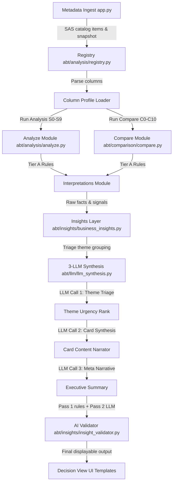

# EDA (Exploratory Data Analysis) — Comprehensive System Documentation

## 1. Problem Statement
In risk modeling lifecycles (development, back-testing, pre-deployment, and production), Analytic Base Tables (ABTs) evolve constantly as new dataset versions are ingested. Without a systematic tool to track dataset health, detect population/schema drift, and flag compliance risks, risk teams face critical problems:
* Deployed credit models (such as Probability of Default - PD, or Loss Given Default - LGD models) degrade silently as the scoring population drifts away from the training baseline.
* System updates introduce silent scoring failures (e.g., deleted features or datatype changes) that propagate through the pipeline without throwing errors.
* Upstream pipeline issues (like ingestion errors or server dropouts) are hard to distinguish from genuine, organic changes in the borrower population.

---

## 2. Pain Points Resolved by EDA
1. **Manual Fragmented Analysis**: Replaces slow, manual spreadsheets with automatic single-version health checks and multi-version comparisons.
2. **No Actionable Decisions**: Translates complex statistics (like PSI, KS, and Skewness) into concrete business decisions (e.g., retrain, rebin, recalibrate, or hold).
3. **Data Loss vs. Real Drift (False Positives)**: Separates pipeline completeness failures (data loss) from organic customer population shifts.
4. **Governance and Explainability Gaps**: Provides natural language narratives and audit trails for risk governance committees.
5. **Integration Bottlenecks**: Offers a clean Decision View data structure that can easily plug into enterprise alert systems or dashboards.

---

## 3. Business Impact & Value Realization

The EDA platform bridges the gap between raw statistical data drift metrics and strategic corporate outcomes. By automating decision intelligence, the system delivers value across four primary business pillars:

### A. Credit Loss Mitigation & Risk Management
Credit scoring models (e.g., PD/LGD) represent the gatekeepers of a financial institution's balance sheet. When borrower demographics or economic indicators shift, models suffer from **extrapolation errors**. EDA detects these shifts early:
*   **Preventing Under-pricing of Risk**: Identifies downward shifts in average borrower credit profiles before defaults spike, prompting model retrains or risk tolerance adjustments.
*   **Avoiding Opportunity Loss**: Prevents models from overestimating risk and rejecting creditworthy candidates in modified market conditions.
*   **Drift Velocity Safeguard**: Tracks the rate of distribution changes over time, giving risk committees early warning signs to act before model performance significantly decays.

### B. Massive Reduction in Operational Overhead
Traditional dataset validation requires risk modelers and data scientists to write bespoke scripts, compile statistical tables, and manually write lengthy analysis documents.
*   **Immediate Diagnostics**: Automates profiling and multi-version comparisons, translating days of data analysis into real-time summaries.
*   **Executive Translation**: Synthesizes mathematical indices (like PSI and KS) into standardized natural language business slots. Non-technical risk managers and committee chairs can make decisions without parsing raw distributions.

### C. Regulatory Compliance & Governance Audit Trails
Financial institutions operate under strict governance models (e.g., Basel guidelines, internal model validation requirements).
*   **Audit Readiness**: The system generates formatted, professional Excel sheets containing full health rule checklists and historical comparison logs to act as official model documentation.
*   **Algorithmic Fairness Guardrails**: Automatically monitors drift in sensitive variables (e.g., age, gender, geographic indicators marked as `private` or regulatory compliance attributes). This flags potential bias issues before models are updated.
*   **Data Minimization (GDPR/CCPA Compliance)**: Because EDA operates entirely on metadata and never ingests raw database records, it naturally satisfies regulatory data privacy requirements by leaving PII untouched at rest in SAS catalogs.

### D. Intelligent Ingestion Diagnostics (Wasted Resource Mitigation)
Data drift alerts often lead to expensive, unnecessary model retraining exercises when the root cause is actually data ingestion issues (e.g., database connection drops or formatting changes).
*   **Technical vs. Organic Drift**: The system separates pipeline breaks (e.g., empty categories or missing values) from real population changes.
*   **Smart Blocking**: Directs engineers to source data fixes first and blocks automated retraining jobs on corrupted datasets, saving expensive computing resources.

---

## 4. Overall Project Structure (Modular sub-packages)
Following strict Single Responsibility Principles (SRP), the core files are organized into 5 domain sub-packages under the `abt/` directory, while the root directory maintains backward-compatible forwarding wrappers:

```
abt/
├── __init__.py
│
├── analysis/               # Single-version analysis and profile loaders
│   ├── __init__.py
│   ├── analyze.py          # Entry orchestration for single version
│   ├── analyze_rules.py    # Hard rules (blockers, warnings, governance, readiness score)
│   ├── columnProfile.py    # Profiler definitions for ColumnProfile and ABTProfile
│   ├── registry.py         # Version ingestion, registry catalog, and table metadata
│   ├── threshold_config.py # Configurable thresholds (completeness, mismatch limits)
│   └── export.py           # Exports analysis results to XLSX files
│
├── comparison/             # Multi-version comparisons
│   ├── __init__.py
│   ├── compare.py          # Entry orchestration for compare sections (C0-C10)
│   ├── compare_schema.py   # Schema change and cardinality drift checks
│   ├── compare_distribution.py # PSI matrix, target rate, health score trend comparisons
│   ├── drift_metrics.py    # Baseline drift suite calculations helper
│   ├── metrics_base.py     # Quantiles, boundary, variance, and standard scale logic
│   └── metrics_drift.py    # Longitudinal statistics and Basel-aligned metrics
│
├── llm/                    # Prompt-chaining and AI narrative generation
│   ├── __init__.py
│   ├── llm_client.py       # Core call utility with timeouts and fallback error handling
│   ├── llm_config.py       # Azure OpenAI environment and completions paths cleanups
│   ├── llm_prompts.py      # Prompt definitions (triage, card generation, meta-narratives)
│   ├── llm_theme_builder.py# Themes grouping and composite facts builder
│   ├── llm_signal_collector.py # Harvests rule-based signals for prompt chaining
│   ├── llm_synthesis.py    # Synthesis orchestration (triage call, card call, meta call)
│   ├── llm_insights_analyze.py # Single-version LLM enrichment (S0, S9, S6)
│   ├── llm_insights_compare.py # Multi-version comparative LLM narratives
│   ├── llm_insights_stories.py # Multi-version drift story LLM narratives
│   ├── llm_drift_narratives.py # Orchestrator forwarding to signal_collector & synthesis
│   └── llm_insights.py     # Orchestrator forwarding to LLM insights sub-modules
│
├── insights/               # Business-level insights cards
│   ├── __init__.py
│   ├── business_insights.py# Standard 7-card business insights orchestrator
│   ├── business_slots.py   # Target, pipeline, model scoring risk, and governance cards
│   ├── insight_validator.py# Post-enrichment validators (Pass 1 rules + Pass 2 LLM reviews)
│   ├── insights.py         # Underlying business insights data model and helpers
│   └── signal_collector.py # Column-wise signal collector diagnostics (v2 path)
│
├── interpretations/        # Logical interpretations and action heuristics
│   ├── __init__.py
│   ├── interpretations.py  # Forwarding orchestration for i4-i9
│   ├── interpretations_single.py # Single-version interpretations
│   └── interpretations_compare.py # Comparative version interpretations
│
└── [Forwarding compatibility files in root abt/]
    ├── analyze.py, compare.py, registry.py, threshold_config.py, export.py,
    ├── business_insights.py, insight_validator.py, columnProfile.py,
    └── llm_insights.py, llm_drift_narratives.py, interpretations.py
```

---

## 5. System Architecture & Dataflow

The system processes ingested metadata from SAS Information Catalog through the pipeline described below:



### Flow Steps:
1. **Metadata Ingestion**: The system registers version snapshots based on deterministic column descriptors hashes, storing metadata files in `datadump/`.
2. **Analysis & Comparison**: Calculates health, completeness, missingness trends, PSI matrix, target rate changes, and cardinality explosions.
3. **Tier A Rules Engine**: Logic determines statistical severity (critical/warning/info) and flags anomalies.
4. **Tier B Prompt Chaining**: Ranks signals, synthesizes them into business cards using absolute numbers, and forms a single executive story.
5. **Tier C Validator**: Applies validation checks (logical and LLM review) to align statements with model purpose (e.g. PD/LGD) and prevent contradictions.

---

## 6. Description of Core Sections

### Single-Version Analysis (S-Sections)
* **S0 Readiness Score**: Generates a composite readiness index (0–100) representing dataset quality.
* **S1 Health Summary**: Synthesizes total columns, completeness counts, zero-variance columns, and metadata anomalies.
* **S2 Blockers**: Identifies critical conditions (e.g., missing target variable, high missing rates > 20%) that halt model training.
* **S3 Warnings**: Identifies moderate risks (e.g., high skewness, high missingness 5-20%).
* **S4 Governance**: Scrapes privacy labels (e.g., `private`) to prevent sensitive variables from being used in models.
* **S5 Readiness Rules**: Evaluates standard quality assertions.
* **S6 Target Analysis**: Analyzes minority class imbalance and skewness for target features.
* **S7 Distribution Health**: Identifies right/left-skewed distributions and suggests transformations.
* **S8 Health Scores**: Generates per-column health scores.
* **S9 Action List**: Produces a prioritized task list of data fixes.

### Multi-Version Comparison (C-Sections)
* **C0 Verdict**: Evaluates comparison results to issue a final decision (e.g., `BLOCK`, `BACK_TEST_REQUIRED`, or `CLEAR`).
* **C1 Version Summary**: Summarizes versions compared and column metrics.
* **C2 Schema Changes**: Flags added, dropped, or modified datatypes across consecutive versions.
* **C3 Completeness Drift**: Measures missingness trajectories.
* **C4 Distribution Drift**: Calculates mean shifts and standard deviation changes.
* **C5 Target Drift**: Computes target variable event-rate percentage shifts.
* **C6 Quality Regression**: Evaluates database health indicators.
* **C7 Readiness Change**: Captures version-over-version health modifications.
* **C8 PSI Matrix**: Computes full population stability matrices across version pairs.
* **C9 Score Trends**: Plots performance and score trends.
* **C10 Cardinality Drift**: Detects category count changes.

### Interpretations & Decisions (I-Sections)
* **I4 Population Shift**: Determines population distance from baseline.
* **I5 Target Stability**: Flags organic changes vs. pipeline issues.
* **I6 Feature Drift**: Identifies center shift, boundary expansions, and variance spread.
* **I7 Model Action**: Directs the final retraining schedule.
* **I8 Pipeline Breaks**: Identifies schema conflicts.
* **I9 Pipeline Health**: Summarizes completeness trends.

### Decision View Section (The Executive Control Panel)
The Decision View is the key interface for risk officers. It synthesizes statistical metrics into actionable business decisions and natural language narratives through three phases:

#### 1. The 7 Structured Business Cards (Phase 1)
Orchestrated by `build_business_insights(results, stage)` inside [abt/insights/business_insights.py](abt/insights/business_insights.py), this module generates 7 standardized cards for the business panel. They are dynamically reordered via `_reorder(insights)` to prioritize critical blocker issues (e.g. data loss or target events) at the front:
* **Drift Stories (Slots 1, 2, & 3)**: Diagnoses the top three drifted columns using [abt/insights/signal_collector.py](abt/insights/signal_collector.py). Translates statistical metrics (PSI, KS, variance shift) into a defined business shift (e.g., center shift or boundary change) with qualitative evidence and recommended model remediation actions.
* **Target Behavior (Slot 4)**: Maps event-rate trends (`i5`) to target variable definition shifts.
* **Pipeline Quality (Slot 5)**: Translates completeness trajectories (`i9`) into alerts for data loss or schema quality regressions.
* **Model Scoring Risk (Slot 6)**: Fuses model actions (`i7`) and pipeline break risks (`i8`) to flag out-of-boundary model extrapolation risks.
* **Governance & Fairness (Slot 7)**: Flags sensitive variables (`informationPrivacy=private` flagged in `s4`) that exhibit notable drift (PSI > 0.10) to alert compliance officers of potential bias.

#### 2. The 3-LLM Narrative Chaining Engine (Phase 2)
When the user requests AI analysis, the comparative engine invokes the 3-step prompt chain defined in [abt/llm/llm_synthesis.py](abt/llm/llm_synthesis.py) using the configured prompts in [abt/llm/llm_prompts.py](abt/llm/llm_prompts.py):
1. **Drift Triage (Call 1)**: Accepts the signal pool grouped by logical themes and ranks them in order of priority based on model purpose and business impact.
2. **Card Synthesis (Call 2)**: Triggers an isolated narrative generation call for the top triaged themes. Enforces exact anchors (`I7_DECISION`, `C0_VERDICT`) to prevent hallucinated contradictions, providing quantitative details (e.g., specific shifts towards "lower-income brackets").
3. **Meta Portfolio Narrative (Call 3)**: Combines individual card headlines into a single connecting summary sentence representing the overall credit risk exposure.

#### 3. The Validation Guardrail Layer (Phase 3)
To ensure recommendations align with corporate risk policies, they pass through **[abt/insights/insight_validator.py](abt/insights/insight_validator.py)**:
* **Pass 1: Hard Rules**: Evaluates deterministic logic, such as:
  * *Rule 1*: Replaces any "drop variable" advice for private columns with a governance review requirement.
  * *Rule 2*: Redirects model retrains to pipeline engineering fixes if the drift is due to technical missingness/data loss.
  * *Rule 6*: Strips all model actions if the overall dataset comparison verdict is `BLOCK`.
* **Pass 2: LLM Review (Optional)**: If a rule is triggered and `use_llm` is active, it formats the structured facts and rules for an LLM validator call, strictly parsing the response in JSON format to adjust card narration safely.

---

## 7. What We Have Achieved (Milestones Met)
1. **Decoupled Configuration**: Externalized credentials, endpoints, and deployment names to `.env` files.
2. **Setup Automation**: Created `run.ps1` and `run.bat` to automatically build virtual environments, install packages, copy configurations, and launch the server.
3. **Code Modularization (Phase 2 & 3)**:
   * Successfully broke down massive files into Single Responsibility modules.
   * Restructured all modules into clean domain sub-packages (`analysis`, `comparison`, `llm`, `insights`, `interpretations`).
   * Maintained 100% backward compatibility via root forwarding files, resulting in zero code edits required in `app.py` or existing scripts.
4. **Prompt Quality Refinement**:
   * Refined prompts in `abt/llm/llm_prompts.py` to output highly precise, context-rich business translations of data drift (e.g. using specific terms like "older borrower demographic" or "lower-income brackets").
   * Tailored the consequence text to be feature-specific and purpose-specific, eliminating repetitive template copy-pastes.
5. **Regression Parity**:
   * Re-ran the parity regression tests (`test_parity.py`), confirming that **100% functional parity** is maintained.

---

## 8. Future Enhancements & Roadmap
1. **Database Persistence**: Migrate the flat-file JSON registry to a relational database (e.g. SQLite or PostgreSQL) to scale metadata tracking.
2. **Asynchronous LLM Processing**: Introduce Celery/Redis task workers to process prompt-chaining sequences in the background, improving request response times.
3. **Telemetry & Latency Tracing**: Implement token counters and latency tracking to monitor prompt-chain costs and timeouts.
4. **Continuous Integration (CI) Checks**: Integrate `test_parity.py` into a git workflow (e.g., GitHub Actions) to verify that new code additions do not introduce regressions against baseline snapshots.
