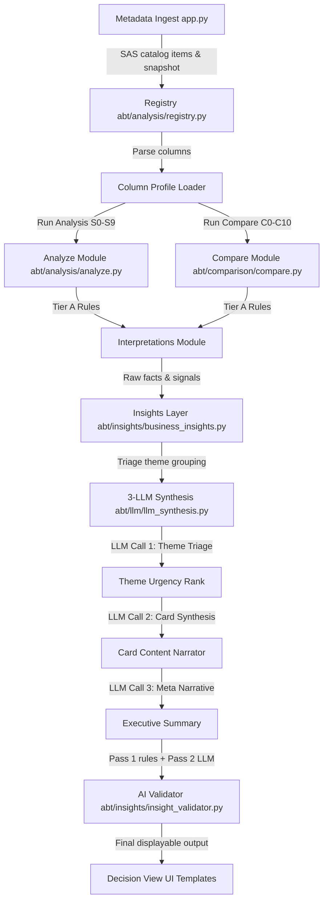

# EDA (Exploratory Data Analysis) — Comprehensive System Documentation

## 1. Problem Statement
In risk modeling lifecycles (development, back-testing, pre-deployment, and production), Analytic Base Tables (ABTs) evolve constantly as new dataset versions are ingested. Without a systematic tool to track dataset health, detect population/schema drift, and flag compliance risks, risk teams face critical problems:
* Deployed credit models (such as Probability of Default - PD, or Loss Given Default - LGD models) degrade silently as the scoring population drifts away from the training baseline.
* System updates introduce silent scoring failures (e.g., deleted features or datatype changes) that propagate through the pipeline without throwing errors.
* Upstream pipeline issues (like ingestion errors or server dropouts) are hard to distinguish from genuine, organic changes in the borrower population.

---

## 2. Pain Points Resolved by RMEDA
1. **Manual Fragmented Analysis**: Replaces slow, manual spreadsheets with automatic single-version health checks and multi-version comparisons.
2. **No Actionable Decisions**: Translates complex statistics (like PSI, KS, and Skewness) into concrete business decisions (e.g., retrain, rebin, recalibrate, or hold).
3. **Data Loss vs. Real Drift (False Positives)**: Separates pipeline completeness failures (data loss) from organic customer population shifts.
4. **Governance and Explainability Gaps**: Provides natural language narratives and audit trails for risk governance committees.
5. **Integration Bottlenecks**: Offers a clean Decision View data structure that can easily plug into enterprise alert systems or dashboards.

---

## 3. Overall Project Structure (Modular sub-packages)
Following strict Single Responsibility Principles (SRP), the core files are organized into 5 domain sub-packages under the `abt/` directory, while the root directory maintains backward-compatible forwarding wrappers:

```
abt/
├── __init__.py
│
├── analysis/               # Single-version analysis and profile loaders
│   ├── __init__.py
│   ├── analyze.py          # Entry orchestration for single version
│   ├── analyze_rules.py    # Hard rules (blockers, warnings, governance, readiness score)
│   ├── columnProfile.py    # Profiler definitions for ColumnProfile and ABTProfile
│   ├── registry.py         # Version ingestion, registry catalog, and table metadata
│   ├── threshold_config.py # Configurable thresholds (completeness, mismatch limits)
│   └── export.py           # Exports analysis results to XLSX files
│
├── comparison/             # Multi-version comparisons
│   ├── __init__.py
│   ├── compare.py          # Entry orchestration for compare sections (C0-C10)
│   ├── compare_schema.py   # Schema change and cardinality drift checks
│   ├── compare_distribution.py # PSI matrix, target rate, health score trend comparisons
│   ├── drift_metrics.py    # Baseline drift suite calculations helper
│   ├── metrics_base.py     # Quantiles, boundary, variance, and standard scale logic
│   └── metrics_drift.py    # Longitudinal statistics and Basel-aligned metrics
│
├── llm/                    # Prompt-chaining and AI narrative generation
│   ├── __init__.py
│   ├── llm_client.py       # Core call utility with timeouts and fallback error handling
│   ├── llm_config.py       # Azure OpenAI environment and completions paths cleanups
│   ├── llm_prompts.py      # Prompt definitions (triage, card generation, meta-narratives)
│   ├── llm_theme_builder.py# Themes grouping and composite facts builder
│   ├── llm_signal_collector.py # Harvests rule-based signals for prompt chaining
│   ├── llm_synthesis.py    # Synthesis orchestration (triage call, card call, meta call)
│   ├── llm_insights_analyze.py # Single-version LLM enrichment (S0, S9, S6)
│   ├── llm_insights_compare.py # Multi-version comparative LLM narratives
│   ├── llm_insights_stories.py # Multi-version drift story LLM narratives
│   ├── llm_drift_narratives.py # Orchestrator forwarding to signal_collector & synthesis
│   └── llm_insights.py     # Orchestrator forwarding to LLM insights sub-modules
│
├── insights/               # Business-level insights cards
│   ├── __init__.py
│   ├── business_insights.py# Standard 7-card business insights orchestrator
│   ├── business_slots.py   # Target, pipeline, model scoring risk, and governance cards
│   ├── insight_validator.py# Post-enrichment validators (Pass 1 rules + Pass 2 LLM reviews)
│   ├── insights.py         # Underlying business insights data model and helpers
│   └── signal_collector.py # Column-wise signal collector diagnostics (v2 path)
│
├── interpretations/        # Logical interpretations and action heuristics
│   ├── __init__.py
│   ├── interpretations.py  # Forwarding orchestration for i4-i9
│   ├── interpretations_single.py # Single-version interpretations
│   └── interpretations_compare.py # Comparative version interpretations
│
└── [Forwarding compatibility files in root abt/]
    ├── analyze.py, compare.py, registry.py, threshold_config.py, export.py,
    ├── business_insights.py, insight_validator.py, columnProfile.py,
    └── llm_insights.py, llm_drift_narratives.py, interpretations.py
```

---

## 4. System Architecture & Dataflow

The system processes ingested metadata from SAS Information Catalog through the pipeline described below:



### Flow Steps:
1. **Metadata Ingestion**: The system registers version snapshots based on deterministic column descriptors hashes, storing metadata files in `datadump/`.
2. **Analysis & Comparison**: Calculates health, completeness, missingness trends, PSI matrix, target rate changes, and cardinality explosions.
3. **Tier A Rules Engine**: Logic determines statistical severity (critical/warning/info) and flags anomalies.
4. **Tier B Prompt Chaining**: Ranks signals, synthesizes them into business cards using absolute numbers, and forms a single executive story.
5. **Tier C Validator**: Applies validation checks (logical and LLM review) to align statements with model purpose (e.g. PD/LGD) and prevent contradictions.

---

## 5. Description of Core Sections

### Single-Version Analysis (S-Sections)
* **S0 Readiness Score**: Generates a composite readiness index (0–100) representing dataset quality.
* **S1 Health Summary**: Synthesizes total columns, completeness counts, zero-variance columns, and metadata anomalies.
* **S2 Blockers**: Identifies critical conditions (e.g., missing target variable, high missing rates > 20%) that halt model training.
* **S3 Warnings**: Identifies moderate risks (e.g., high skewness, high missingness 5-20%).
* **S4 Governance**: Scrapes privacy labels (e.g., `private`) to prevent sensitive variables from being used in models.
* **S5 Readiness Rules**: Evaluates standard quality assertions.
* **S6 Target Analysis**: Analyzes minority class imbalance and skewness for target features.
* **S7 Distribution Health**: Identifies right/left-skewed distributions and suggests transformations.
* **S8 Health Scores**: Generates per-column health scores.
* **S9 Action List**: Produces a prioritized task list of data fixes.

### Multi-Version Comparison (C-Sections)
* **C0 Verdict**: Evaluates comparison results to issue a final decision (e.g., `BLOCK`, `BACK_TEST_REQUIRED`, or `CLEAR`).
* **C1 Version Summary**: Summarizes versions compared and column metrics.
* **C2 Schema Changes**: Flags added, dropped, or modified datatypes across consecutive versions.
* **C3 Completeness Drift**: Measures missingness trajectories.
* **C4 Distribution Drift**: Calculates mean shifts and standard deviation changes.
* **C5 Target Drift**: Computes target variable event-rate percentage shifts.
* **C6 Quality Regression**: Evaluates database health indicators.
* **C7 Readiness Change**: Captures version-over-version health modifications.
* **C8 PSI Matrix**: Computes full population stability matrices across version pairs.
* **C9 Score Trends**: Plots performance and score trends.
* **C10 Cardinality Drift**: Detects category count changes.

### Interpretations & Decisions (I-Sections)
* **I4 Population Shift**: Determines population distance from baseline.
* **I5 Target Stability**: Flags organic changes vs. pipeline issues.
* **I6 Feature Drift**: Identifies center shift, boundary expansions, and variance spread.
* **I7 Model Action**: Directs the final retraining schedule.
* **I8 Pipeline Breaks**: Identifies schema conflicts.
* **I9 Pipeline Health**: Summarizes completeness trends.

---

## 6. What We Have Achieved (Milestones Met)
1. **Decoupled Configuration**: Externalized credentials, endpoints, and deployment names to `.env` files.
2. **Setup Automation**: Created `run.ps1` and `run.bat` to automatically build virtual environments, install packages, copy configurations, and launch the server.
3. **Code Modularization (Phase 2 & 3)**:
   * Successfully broke down massive files into Single Responsibility modules.
   * Restructured all modules into clean domain sub-packages (`analysis`, `comparison`, `llm`, `insights`, `interpretations`).
   * Maintained 100% backward compatibility via root forwarding files, resulting in zero code edits required in `app.py` or existing scripts.
4. **Prompt Quality Refinement**:
   * Refined prompts in `abt/llm/llm_prompts.py` to output highly precise, context-rich business translations of data drift (e.g. using specific terms like "older borrower demographic" or "lower-income brackets").
   * Tailored the consequence text to be feature-specific and purpose-specific, eliminating repetitive template copy-pastes.
5. **Regression Parity**:
   * Re-ran the parity regression tests (`test_parity.py`), confirming that **100% functional parity** is maintained.

---

## 7. Future Enhancements & Roadmap
1. **Database Persistence**: Migrate the flat-file JSON registry to a relational database (e.g. SQLite or PostgreSQL) to scale metadata tracking.
2. **Asynchronous LLM Processing**: Introduce Celery/Redis task workers to process prompt-chaining sequences in the background, improving request response times.
3. **Telemetry & Latency Tracing**: Implement token counters and latency tracking to monitor prompt-chain costs and timeouts.
4. **Continuous Integration (CI) Checks**: Integrate `test_parity.py` into a git workflow (e.g., GitHub Actions) to verify that new code additions do not introduce regressions against baseline snapshots.
