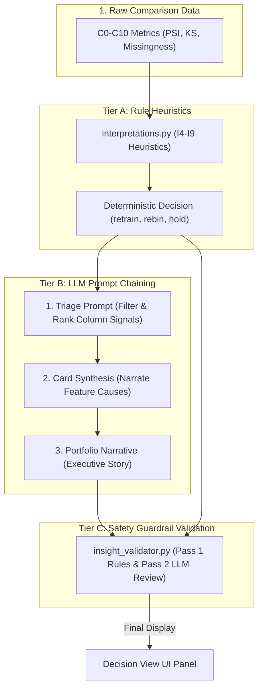

# EDA — System Learning & Architectural Summary

This document serves as a comprehensive learning summary for the **Risk Model Exploratory Data Analysis (EDA)** system. It integrates the theoretical foundations, technological stack, architectural approaches, and core design patterns that govern this metadata-driven decision intelligence platform.

---

## 1. Problem Statement & Motivation

In the credit risk modeling lifecycle, models such as **Probability of Default (PD)** or **Loss Given Default (LGD)** are trained on historical populations. Once deployed, these models face a major challenge: **silent data degradation**. 

### The Core Challenges:
*   **Population Drift**: Scoring populations evolve over time (e.g., due to macroeconomic changes or shifting marketing strategies), leading to model performance decay.
*   **Silent Failures**: Technical changes in upstream pipelines (e.g., schema modifications, missing values, or format changes) propagate without throwing system crashes.
*   **The Raw Data Constraint**: Risk models often run in highly regulated environments. Transferring, loading, and analyzing raw borrower datasets containing sensitive personal and financial data introduces significant regulatory, computation, and storage overhead.

### The EDA Solution:
EDA is a **metadata-only decision intelligence system**. By design, **it never accesses raw dataset rows**. Instead, it ingests pre-computed statistical summaries (quantile distributions, completeness percentages, cardinality lists, and privacy attributes) from upstream catalogs (e.g., SAS Information Catalog). It then applies a layered system of rules, statistical comparisons, and LLM-driven narration to output human-readable, validated business actions.

---

## 2. Theoretical Foundations (The Mathematics of Drift)

EDA translates raw statistical comparisons into structured decisions using several key mathematical and distribution monitoring formulations:

### A. Population Stability Index (PSI)
The primary metric used to quantify distribution shifts between a baseline dataset version ($B$) and a new target version ($N$):

$$\text{PSI} = \sum_{i=1}^{k} \left( \left( P_i(N) - P_i(B) \right) \times \ln\left( \frac{P_i(N)}{P_i(B)} \right) \right)$$

*   Where $P_i$ represents the proportion of records in bucket $i$.
*   **Union Boundary Approach**: Since EDA cannot access raw rows, it defines buckets using the union of boundaries. It constructs 5 bin partitions using base quantiles ($Q_1$, $Median$, $Q_3$) and the combined minimum and maximum values across both versions.
*   **Risk Thresholds**:
    *   $\text{PSI} < 0.10$: **Stable** (no action required).
    *   $0.10 \le \text{PSI} < 0.25$: **Moderate Drift** (monitor or recalibrate model bins).
    *   $\text{PSI} \ge 0.25$: **Significant Shift** (model action required, e.g., retrain).

### B. Approximate Kolmogorov-Smirnov (KS) Statistic
The KS test measures the maximum vertical distance between cumulative distribution functions (CDFs):

$$D = \max_{x} \left| F_{\text{base}}(x) - F_{\text{new}}(x) \right|$$

*   **System Implementation**: Since raw CDFs are unavailable, EDA interpolates CDF values at five key quantile points (min, $Q_1$, median, $Q_3$, max) to estimate the maximum CDF divergence. This serves as a secondary check to confirm PSI findings.

### C. Coefficient of Variation (CV) Drift
Monitors relative dispersion shifts for numeric attributes:

$$\text{CV} = \frac{\sigma}{|\mu|}$$

$$\text{Relative Change} = \frac{|\text{CV}_{\text{new}} - \text{CV}_{\text{base}}|}{\text{CV}_{\text{base}}}$$

*   A significant shift in CV indicates changes in feature noise levels, warning modeling teams that current feature scaling or Weight of Evidence (WoE) boundaries may be invalid.

### D. Quantile Shift & Boundary Extrapolation
*   **Quantile Shift**: Measures the displacement of the distribution center or tails, normalized by the baseline Interquartile Range (IQR):
    $$\text{Shift} = \frac{q_{\text{new}} - q_{\text{base}}}{\text{IQR}_{\text{base}}}$$
*   **Boundary Drift**: Identifies tail expansion or compression. If boundaries expand ($\text{Boundary Shift} \ge 0.25$), the scoring model will extrapolate beyond its training boundaries, posing severe scoring risks.

### E. Longitudinal Stability Metrics
*   **Feature Stability Index (FSI)**:
    $$\text{FSI} = \max\left(0, 1 - \frac{\text{Mean PSI}}{\text{PSI Monitor Threshold}}\right)$$
    Measures long-term stability across multiple versions. Low FSI values identify columns that drift consistently over time.
*   **Drift Velocity**:
    The slope of a linear regression fit of pairwise PSI values over time:
    $$\text{Velocity} = \beta_1 = \frac{N\sum(x_i y_i) - \sum x_i \sum y_i}{N\sum x_i^2 - (\sum x_i)^2}$$
    Quantifies the speed of drift to warn teams of imminent model degradation before full validation failures occur.

### F. Categorical Entropy Drift
Estimates changes in category diversity using Shannon Entropy:

$$H = -\sum_{i=1}^{k} p_i \log_2(p_i)$$

*   Calculated from cardinality counts and uniqueness percentages. Helps flag category consolidation (decreased entropy) or cardinality explosion (increased entropy).

---

## 3. Technological Ecosystem

The EDA platform is built using a lightweight, performant, and highly modular technology stack:

| Technology Layer | Tool / Library | Role & Purpose |
|:---|:---|:---|
| **Web Server & Routing** | Flask (Python) | Exposes REST endpoints for metadata ingestion (`/api/ingest`), handles configuration states, and manages controller logic. |
| **User Interface** | HTML5, Vanilla CSS, Jinja2 | Renders a responsive dashboard utilizing premium dark mode elements, visual cards, and responsive forms. |
| **Diagrams & Flowcharts** | Mermaid.js | Embedded directly in documentation to render interactive data flow and architecture diagrams. |
| **Data Ingestion Registry** | Local JSON flat-file storage | Stores dataset version metadata under the `datadump/` directory, avoiding database installation overhead. |
| **Domain Data Modeling** | Python Classes | Maps metadata into structured Python structures (`ABTProfile` and `ColumnProfile`) at runtime. |
| **AI Integration** | Microsoft Azure OpenAI | Powering drift narration, triage, synthesis, and safety validation guardrails. |
| **AI HTTP Client Adapter** | `urllib` (Standard Library) | Custom wrapper in `abt/llm/llm_client.py` that implements request timeouts, custom headers, SSL configurations, and corporate proxy support without external library dependencies. |
| **Audit Export** | `openpyxl` | Generates formatted Excel spreadsheets containing full health rules audits and version comparisons for compliance reviews. |

---

## 4. Applied Approaches & Architectural Patterns

EDA adopts several advanced software engineering paradigms to keep the codebase maintainable, secure, and robust:

### A. Modular Design (Single Responsibility Principle)
The core logic is structured into self-contained sub-packages under the `abt/` folder:
1.  **`abt/analysis/`**: Responsible for profile loading, version cataloging, and single-version health checks (S0-S9 rules).
2.  **`abt/comparison/`**: Orchestrates version-over-version comparisons and runs statistical drift calculations (C0-C10 rules).
3.  **`abt/llm/`**: Manages LLM client connectivity, prompt configurations, and chaining workflows.
4.  **`abt/insights/`**: Generates structured business cards and runs safety validation rules.
5.  **`abt/interpretations/`**: Houses logical decision engines (I4-I9 heuristics) to deduce root causes.

### B. Backward-Compatible Delegation Layer
To avoid breaking existing interfaces (such as `app.py` or `test_parity.py`), forwarding wrappers are placed in the root `abt/` directory. These wrappers re-expose the public interfaces of modular sub-packages, ensuring that folder structure reorganization requires zero changes in calling client modules.

### C. 3-Tier Decision Intelligence Architecture
The core value of EDA lies in its three-tier approach to transforming data metrics into business-level decisions:

#### 1. Tier A: Deterministic Rule Heuristics
A rule-based heuristic engine evaluates statistical outputs to categorize risks (critical, warning, info) and determine default remediation actions. This ensures a consistent, mathematically grounded baseline.

#### 2. Tier B: 3-LLM Prompt Chaining (Drift Narrative Engine)
Rather than executing a single, complex LLM call that is prone to hallucination, the system chains three separate prompts:
*   **Triage Call**: Compiles all column signals and ranks them by business urgency.
*   **Card Synthesis Call**: Generates a natural language headline and evidence block for the top triaged columns, converting technical variables (like `dti`) into human-readable concepts ("debt-to-income ratio") and applying strict headline constraints.
*   **Meta Narrative Call**: Generates a single connecting sentence that summarizes the entire dataset comparison for executive presentations.

#### 3. Tier C: Validation Guardrail Layer (`insight_validator.py`)
To prevent the LLM from making decisions that violate corporate credit policies, all insights pass through a final validation layer:
*   **Pass 1 (Deterministic Hard Rules)**: Prevents recommending that key credit variables (like income) be dropped, prepends regulatory warnings for sensitive attributes, and strips model actions if the overall comparison verdict is `BLOCK`.
*   **Pass 2 (LLM Review)**: If a rule is triggered and `use_llm` is active, it formats the structured facts and rules for an LLM validator call, strictly parsing the response in JSON format to adjust card narration safely.

---

## 5. Business Impact & Value Realization

By integrating automated statistical audit checks with AI-driven narrative generation and deterministic compliance rules, EDA delivers concrete business value across four distinct domains:

### A. Credit Loss Mitigation & Balance Sheet Security
Credit risk models act as the gatekeepers of loan book quality. Silent distribution drift leads directly to model decay, resulting in miscalculated credit scoring:
*   **Underestimated Risk (Write-offs)**: If borrower profiles drift downward (e.g., debt burden rises) and the model is not retrained, it will approve high-risk applicants under outdated parameters, increasing default write-offs.
*   **Overestimated Risk (Opportunity Cost)**: Conversely, if the population shifts positively but the model extrapolates incorrectly, it will reject creditworthy borrowers, resulting in lost market share and interest income.
*   **Early Intervention**: Identifying drift velocity allows risk officers to schedule bin modifications or retrains *before* validation limits are breached and losses are realized.

### B. Operational Efficiency & Time-to-Insight
Manual exploratory data analysis, comparison reporting, and validation documentation is a tedious process for modeling teams:
*   **Instant Diagnostics**: Reduces dataset version auditing from weeks of manual scripting down to seconds.
*   **Executive Transparency**: The **Decision View** translates math-heavy indices (PSI, KS) into structured natural language cards, allowing risk committees and non-technical stakeholders to evaluate model safety instantly.

### C. Regulatory Compliance & Data Privacy
Regulated financial environments (e.g., Basel, GDPR, CCPA) place severe constraints on model validation and data access:
*   **Audit Readiness**: Generates fully formatted XLSX compliance audit reports with complete rule logs, providing automated documentation for external regulators and internal auditors.
*   **Algorithmic Bias Safeguard**: Monitors drift in features labeled `private` (sensitive classes), alerting compliance officers of potential fairness violations.
*   **Data Minimization**: By reading metadata instead of raw datasets, the tool ensures absolute compliance with personal data restrictions, preventing PII data exposure.

### D. Computational Cost Reduction (Technical vs. Organic Drift)
Machine learning retraining loops are computationally expensive:
*   **Smart Ingestion Audit**: The validator separates pipeline data loss (technical failures) from borrower behavior shifts (organic drift). If missingness spikes due to a pipeline break, it blocks retraining, preventing systems from retraining models on corrupted datasets.

---

## 6. Summary of Key Developer Learning

1.  **Strict Separation of Concerns**: Isolating the statistical calculation code (`abt/comparison/`) from the business mapping code (`abt/insights/`) and AI narration code (`abt/llm/`) makes the system highly testable. Unit tests can assert statistical correctness without mock-stubbing OpenAI endpoints.
2.  **Robust LLM Chaining**: Complex tasks are best solved by broken-down, structured LLM prompt chains. Forcing exact anchors (like `I7_DECISION` or `C0_VERDICT`) into prompt templates prevents LLM narratives from contradicting deterministic rule engines.
3.  **Heuristics as a Safety Net**: In enterprise applications, generative AI should not have the final say on operational actions. Placing a deterministic validation layer (`insight_validator.py`) at the output of the LLM narrative engine ensures that AI output remains compliant with domain guidelines (e.g., Credit Risk Governance).
4.  **Decoupled Infrastructure**: Keeping the ingestion framework independent of target dataset storage (by reading metadata-only snapshots) allows the system to easily integrate with various database layouts and workflow managers.
