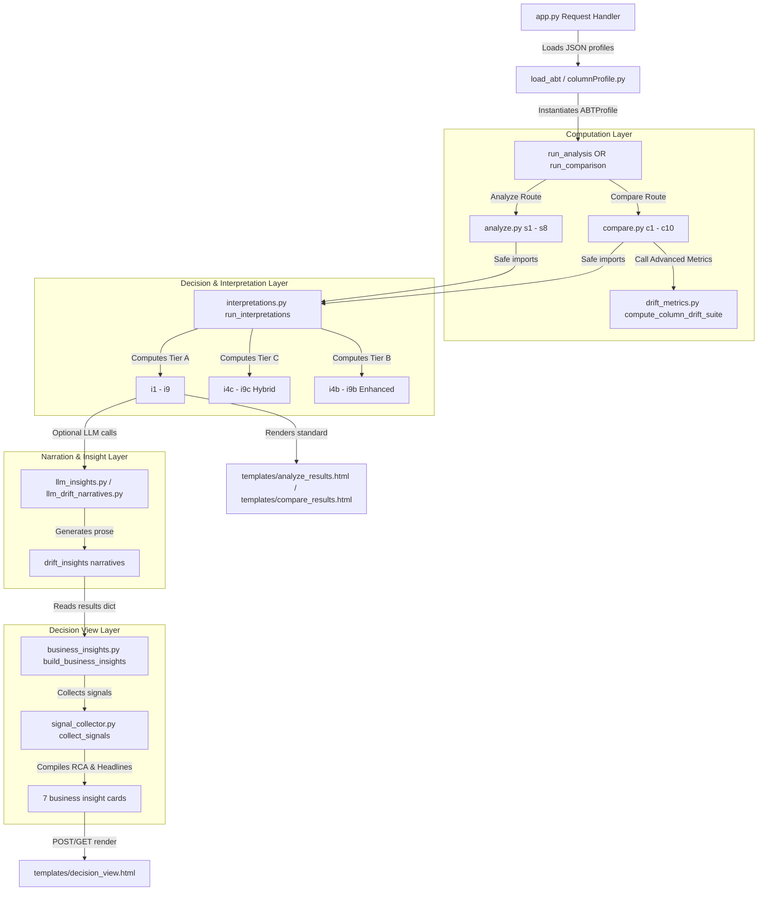

# RMEDA Service — Repository Tracking & Analysis

This document provides a comprehensive mapping of the **RMEDA (Risk Modeling Exploratory Data Analysis) Service** codebase. It traces the UI elements shown on the output pages back to the backend code and details the data flow. It also identifies redundant, dead, or unused code within the repository.

---

## 1. Executive Summary & Core Discovery

During the analysis of the repository, several significant architectural issues were discovered:
1. **Commented Duplicate Code Blobs**: The files [analyze.py](file:///c:/Smeet_internTask/analysisWork3/abt/analyze.py), [compare.py](file:///c:/Smeet_internTask/analysisWork3/abt/compare.py), and [interpretations.py](file:///c:/Smeet_internTask/analysisWork3/abt/interpretations.py) contain thousands of lines of commented-out duplicates of their own contents (some files have duplicates repeated twice). This inflates file sizes unnecessarily.
2. **Interpretation Layer Overrides**: At the bottom of [interpretations.py](file:///c:/Smeet_internTask/analysisWork3/abt/interpretations.py) (lines 3046–3135), the wrapper functions `run_interpretations`, `run_interpretations_hybrid`, and `run_interpretations_enhanced` are redefined and appended. These redefinitions:
   - Overwrite the earlier implementations.
   - Disable **Tier B (Enhanced)** and **Tier C (Hybrid)** interpretations by returning the results dict unchanged.
   - Break single-version interpretations (`i1`, `i2`, `i3`) because the active `run_interpretations` function at the bottom only computes compare metrics.
3. **Dead Templates**: The templates [analyze_resultsnoAI.html](file:///c:/Smeet_internTask/analysisWork3/templates/analyze_resultsnoAI.html) and [compare_results_noAI.html](file:///c:/Smeet_internTask/analysisWork3/templates/compare_results_noAI.html) are completely dead and never rendered or referenced by Flask routes in [app.py](file:///c:/Smeet_internTask/analysisWork3/app.py).

---

## 2. Output Page & UI Section Mapping

Below is the mapping of each section shown on the output dashboard pages back to the code and functions that compute them.

### A. Single Version Analysis Page (`templates/analyze_results.html`)
This page is generated when a user runs an analysis on a single version of an ABT dataset.

| UI Section / Tab | Section Code | Backend Function / File | Purpose & Data Flow |
| :--- | :--- | :--- | :--- |
| **Headline: Dataset Readiness Score** | **S0** | `s0_readiness_score` in [analyze.py](file:///c:/Smeet_internTask/analysisWork3/abt/analyze.py) calling `dataset_readiness_score` in [insights.py](file:///c:/Smeet_internTask/analysisWork3/abt/insights.py) | Computes a weighted average score (0-100) of column health scores. Count blocked columns as `0.0`. |
| **Overall Health Summary** | **S1** | `s1_health_summary` in [analyze.py](file:///c:/Smeet_internTask/analysisWork3/abt/analyze.py) | Tallies overall indicators: total columns, fully complete, high missing, zero variance, and mismatches. |
| **Blockers Checklist** | **S2** | `s2_blockers` in [analyze.py](file:///c:/Smeet_internTask/analysisWork3/abt/analyze.py) | Identifies columns requiring immediate action (e.g. completeness < 50%, unary scale, mismatch rate > 15%). |
| **Data Quality Warnings** | **S3** | `s3_warnings` in [analyze.py](file:///c:/Smeet_internTask/analysisWork3/abt/analyze.py) | Identifies minor issues like partial missingness, blank strings, or format mismatches. |
| **Governance & Leakage risks** | **S4** | `s4_governance` in [analyze.py](file:///c:/Smeet_internTask/analysisWork3/abt/analyze.py) | Checks for identifiers, privacy flags, and target leakages (bounded [0, 1] with high cardinality). |
| **Column Readiness Classification** | **S5** | `s5_readiness` in [analyze.py](file:///c:/Smeet_internTask/analysisWork3/abt/analyze.py) | Classifies columns into statuses: `ready`, `caution`, or `drop`. |
| **Target Variable Analysis** | **S6** | `s6_target_analysis` in [analyze.py](file:///c:/Smeet_internTask/analysisWork3/abt/analyze.py) | Analyzes class balance, event rate, non-event rate, and skewness for the target column. |
| **Distribution Health** | **S7** | `s7_distribution_health` in [analyze.py](file:///c:/Smeet_internTask/analysisWork3/abt/analyze.py) | Evaluates numeric features for skewness (left/right/symmetric), outliers, IQR symmetry, and suggests transformations. |
| **Column Health Scores** | **S8** | `s8_column_health_scores` in [analyze.py](file:///c:/Smeet_internTask/analysisWork3/abt/analyze.py) calling `column_health_score` in [insights.py](file:///c:/Smeet_internTask/analysisWork3/abt/insights.py) | Computes a 0-100 composite health score per column. |
| **Prioritized Action List** | **S9** | `s9_action_list` in [analyze.py](file:///c:/Smeet_internTask/analysisWork3/abt/analyze.py) calling `build_action_list` in [insights.py](file:///c:/Smeet_internTask/analysisWork3/abt/insights.py) | Ranks recommended data fixes based on severity × modeling impact. |
| **Interpretations: Usability Verdicts** | **I1** | `i1_feature_verdicts` in [interpretations.py](file:///c:/Smeet_internTask/analysisWork3/abt/interpretations.py) | Recommends feature action: `use`, `fix_then_use`, `drop`, or `exclude`. *(Broken due to override at the bottom of interpretations.py)* |
| **Interpretations: Training Readiness** | **I2** | `i2_training_readiness` in [interpretations.py](file:///c:/Smeet_internTask/analysisWork3/abt/interpretations.py) | Prescribes modeling splits, metric selection, and resampling guidance based on class imbalance. *(Broken)* |
| **Interpretations: Preprocessing Checklist**| **I3** | `i3_preprocessing_checklist` in [interpretations.py](file:///c:/Smeet_internTask/analysisWork3/abt/interpretations.py) | Ranks data quality corrections sequentially (quality fix → imputation → outlier cap → transformation → encoding). *(Broken)* |

---

### B. Version Comparison Page (`templates/compare_results.html`)
Renders comparison results across 2 or more consecutive versions.

| UI Section / Tab | Section Code | Backend Function / File | Purpose & Data Flow |
| :--- | :--- | :--- | :--- |
| **Headline Verdict Banner** | **C0** | `c0_compare_verdict` in [compare.py](file:///c:/Smeet_internTask/analysisWork3/abt/compare.py) | Synthesizes target drift, PSI, readiness, and health score deltas into: `CLEAR`, `MONITOR`, `BACK_TEST_REQUIRED`, or `BLOCK`. |
| **Version Diff Summary** | **C1** | `c1_version_summary` in [compare.py](file:///c:/Smeet_internTask/analysisWork3/abt/compare.py) | Computes pairwise deltas in row counts, column counts, added/dropped columns, and worsened/improved columns. |
| **Schema Changes** | **C2** | `c2_schema_changes` in [compare.py](file:///c:/Smeet_internTask/analysisWork3/abt/compare.py) | Identifies added, dropped, and data-type/statistical-scale modified columns. |
| **Completeness Drift** | **C3** | `c3_completeness_drift` in [compare.py](file:///c:/Smeet_internTask/analysisWork3/abt/compare.py) | Classifies missingness profiles (e.g. `newly_missing`, `growing_missing`, `stable_missing`, `sparse`). |
| **Distribution Drift** | **C4** | `c4_distribution_drift` in [compare.py](file:///c:/Smeet_internTask/analysisWork3/abt/compare.py) | Monitors numeric feature means, standard deviation drift scores, skew flips, and outlier introductions. |
| **Target Variable Drift** | **C5** | `c5_target_drift` in [compare.py](file:///c:/Smeet_internTask/analysisWork3/abt/compare.py) | Evaluates target event rate shifts and flags if a model back-test is required. |
| **Quality Regression Tracker**| **C6** | `c6_quality_regression` in [compare.py](file:///c:/Smeet_internTask/analysisWork3/abt/compare.py) | Monitors mismatch and blank string count trends across consecutive pairs. |
| **Readiness Change Summary** | **C7** | `c7_readiness_change` in [compare.py](file:///c:/Smeet_internTask/analysisWork3/abt/compare.py) | Tallies status movements (e.g., ready → caution, drop → ready) for all columns across versions. |
| **PSI Matrix** | **C8** | `c8_psi_matrix` in [compare.py](file:///c:/Smeet_internTask/analysisWork3/abt/compare.py) calling `_psi_matrix_union` in [drift_metrics.py](file:///c:/Smeet_internTask/analysisWork3/abt/drift_metrics.py) | Computes Population Stability Index using quantile boundaries. |
| **Health Score Trend** | **C9** | `c9_health_score_trend` in [compare.py](file:///c:/Smeet_internTask/analysisWork3/abt/compare.py) | Tracks dataset readiness score and column scores over time, calculating trend slopes and directions. |
| **Cardinality Drift** | **C10** | `c10_cardinality_drift` in [compare.py](file:///c:/Smeet_internTask/analysisWork3/abt/compare.py) | Identifies cardinality explosion (nominal categories multiplying by >50%). |
| **Advanced Drift Suite** | **C11** | `compute_column_drift_suite` in [drift_metrics.py](file:///c:/Smeet_internTask/analysisWork3/abt/drift_metrics.py) | Computes advanced metrics: FSI, velocity, baseline drift, KS approximation, CV, and quantile shifts. |
| **Interpretations: Population Shift**| **I4** | `i4_population_shift` in [interpretations.py](file:///c:/Smeet_internTask/analysisWork3/abt/interpretations.py) | Analyzes if the dataset drift is broad or narrow, and maps it to causes like `sampling_change` or `organic_shift`. |
| **Interpretations: Target Stability**| **I5** | `i5_target_stability` in [interpretations.py](file:///c:/Smeet_internTask/analysisWork3/abt/interpretations.py) | Assesses target outcomes over time to flags risks of definition/coding changes or pipeline label loss. |
| **Interpretations: Feature Drift Impact**| **I6** | `i6_feature_drift_impact` in [interpretations.py](file:///c:/Smeet_internTask/analysisWork3/abt/interpretations.py) | Pinpoints mechanisms (center shift, boundary expansion, spread change) and recommends feature fixes. |
| **Interpretations: Model Action** | **I7** | `i7_model_action` in [interpretations.py](file:///c:/Smeet_internTask/analysisWork3/abt/interpretations.py) | Synthesizes results to recommend a model action: `retrain`, `rebin`, `recalibrate`, or `hold`. |
| **Interpretations: Pipeline Break Risks**| **I8** | `i8_pipeline_break_risks` in [interpretations.py](file:///c:/Smeet_internTask/analysisWork3/abt/interpretations.py) | Flags changes (dropped fields, type shifts) that will silently break scorecard scoring. |
| **Interpretations: Pipeline Health** | **I9** | `i9_pipeline_health` in [interpretations.py](file:///c:/Smeet_internTask/analysisWork3/abt/interpretations.py) | Reviews overall dataset health indicators and tells engineering if systematic data failures exist. |

---

### C. Decision View Page (`templates/decision_view.html`)
This is the executive summary dashboard. It shows 7 slots (insight cards) summarizing data drift from a risk management standpoint.

- **Verdicts & Banners**: Driven by `i7` model action output (`decision` and `reason`).
- **Dynamic Reordering**: Handled by `_reorder` in [business_insights.py](file:///c:/Smeet_internTask/analysisWork3/abt/business_insights.py), which pulls critical target or pipeline quality failures to the front of the view.

| Slot / Insight Card | Backend Function / File | Purpose & Data Flow |
| :--- | :--- | :--- |
| **Drift Story 1, 2, 3** | `_top_drift_insights` in [business_insights.py](file:///c:/Smeet_internTask/analysisWork3/abt/business_insights.py) | Collects population signals via [signal_collector.py](file:///c:/Smeet_internTask/analysisWork3/abt/signal_collector.py). For the top 3 shifted columns, diagnoses exact root causes (center shift, boundary expansion, spread change) and builds Layer 1headlines, Layer 2 evidence, and Layer 3 recommendations. |
| **Target Behavior** | `_insight_target` in [business_insights.py](file:///c:/Smeet_internTask/analysisWork3/abt/business_insights.py) | Translates `i5` target stability indicators into business implications (outcome changes, label definition events). |
| **Pipeline Quality** | `_insight_pipeline` in [business_insights.py](file:///c:/Smeet_internTask/analysisWork3/abt/business_insights.py) | Reviews `i9` completeness metrics to tell the business if data quality is stable or degrading. |
| **Model Scoring Risk** | `_insight_model_risk` in [business_insights.py](file:///c:/Smeet_internTask/analysisWork3/abt/business_insights.py) | Reviews `i7` decisions and `i8` pipeline break risks to warn if model outputs will contain extrapolation errors. |
| **Governance & Fairness** | `_insight_governance` in [business_insights.py](file:///c:/Smeet_internTask/analysisWork3/abt/business_insights.py) | Identifies features with `informationPrivacy=private` that have drifted (PSI > 0.10) to flag regulatory/fairness issues. |

---

## 3. Data Flow Architecture

The data flows through the application via well-defined pipeline steps:

---

## 4. Cleanup Status & Removed Code

Below is the status of the redundant, dead, and unused code in the repository:

### A. Commented Duplicate Code Blocks inside Active Files (Cleaned)
The commented-out duplicates of module contents inside the following files have been successfully removed:
*   `abt/analyze.py`
*   `abt/compare.py`
*   `abt/llm_insights.py`

### B. Overridden Wrapper Functions inside Active Files (Cleaned)
The legacy overrides block at the bottom of `abt/interpretations.py` has been deleted, successfully restoring the full implementations of `run_interpretations`, `run_interpretations_hybrid`, and `run_interpretations_enhanced`.

### C. Unused Templates (Deleted)
The following unused templates have been deleted from the `templates/` folder:
*   `templates/analyze_resultsnoAI.html`
*   `templates/compare_results_noAI.html`

### D. Scratch and Test Scripts (Deleted)
The following developer utility scratch scripts have been deleted from the root folder:
*   `migrate.py`
*   `test_llm.py`

