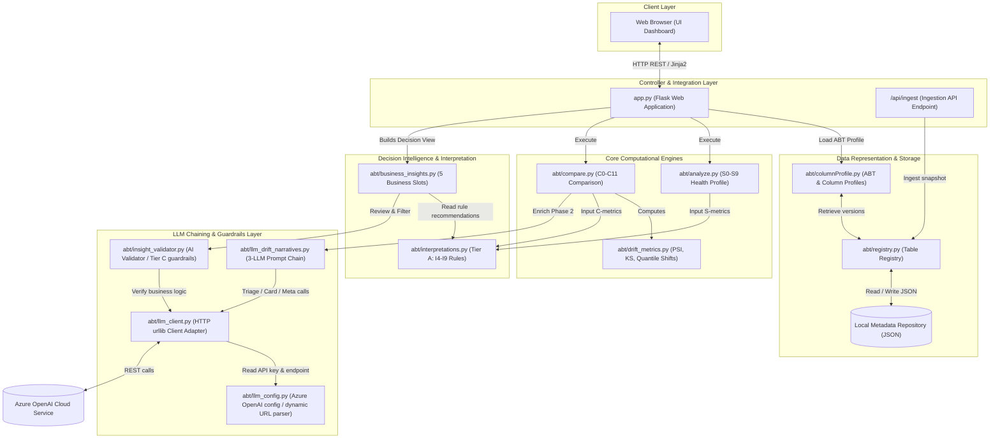

# RMEDA — System Architecture Blueprint

This document details the software architecture, component models, data flows, and integration paradigms of the **Risk Modeling Exploratory Data Analysis (RMEDA)** system.

---

## 1. Architectural Overview

RMEDA is a metadata-driven decision intelligence system. By constraint, it never touches raw datasets. Instead, it reads pre-computed statistical summaries (KPIs, column profiles, missingness states, and quantile distributions) from SAS or the SAS Information Catalog (IC).

The system follows a layered architecture model:



---

## 2. Core Modules & Component Mapping

| Component Module | Files | Architectural Role | Key Responsibilities |
|:---|:---|:---|:---|
| **Web Server & UI** | [app.py](file:///c:/Smeet_internTask/analysisWork3/app.py)<br>templates/<br>static/ | **MVC Controller & View** | Exposes HTTP routes, handles stages and threshold configuration states, routes user requests to comparative engines, and renders results. |
| **Ingestion & Registry** | [abt/registry.py](file:///c:/Smeet_internTask/analysisWork3/abt/registry.py)<br>datadump/ | **Data Ingestion Engine** | Receives metadata payloads from upstream catalogs (IC), saves snapshots as local JSON records, and maintains dataset version indexes. |
| **Data Models** | [abt/columnProfile.py](file:///c:/Smeet_internTask/analysisWork3/abt/columnProfile.py) | **Domain Representation** | Reconstructs metadata into Python objects (`ABTProfile`, `ColumnProfile`) and formats statistical structures. |
| **Analysis Engine** | [abt/analyze.py](file:///c:/Smeet_internTask/analysisWork3/abt/analyze.py)<br>[abt/threshold_config.py](file:///c:/Smeet_internTask/analysisWork3/abt/threshold_config.py) | **Single-Version Auditor** | Calculates version scores, identifies data quality blockers, audits data governance/privacy risks, and produces remediation action lists. |
| **Comparison & Metrics** | [abt/compare.py](file:///c:/Smeet_internTask/analysisWork3/abt/compare.py)<br>[abt/drift_metrics.py](file:///c:/Smeet_internTask/analysisWork3/abt/drift_metrics.py) | **Multi-Version Evaluator** | Executes version comparisons. Computes math-heavy metrics (Basel PSI, quantile variance, standard deviation shifts) across consecutive datasets. |
| **Tier A Decision Engine** | [abt/interpretations.py](file:///c:/Smeet_internTask/analysisWork3/abt/interpretations.py) | **Rule-Based Decision Engine** | Deduces statistical causes (organic shift, sampling change, pipeline issues, label event) and recommends models actions (`rebin`, `retrain`, `hold`). |
| **Decision Intelligence** | [abt/business_insights.py](file:///c:/Smeet_internTask/analysisWork3/abt/business_insights.py) | **Business Insight Director** | Maps complex statistical metrics into 5 fixed business slots (Population, Target, Pipeline, Scoring Risk, Governance). |
| **AI Validator (Guardrail)**| [abt/insight_validator.py](file:///c:/Smeet_internTask/analysisWork3/abt/insight_validator.py) | **Safety Layer (Tier C)** | Intercepts Rule-Based insights and uses LLM verification to correct illogical recommendations (e.g. preventing the dropping of key risk predictors). |
| **AI Narrator & Chaining** | [abt/llm_drift_narratives.py](file:///c:/Smeet_internTask/analysisWork3/abt/llm_drift_narratives.py)<br>[abt/llm_client.py](file:///c:/Smeet_internTask/analysisWork3/abt/llm_client.py)<br>[abt/llm_config.py](file:///c:/Smeet_internTask/analysisWork3/abt/llm_config.py) | **AI Narrative & Ranking Layer** | Executes the 3-LLM prompt chain to rank, narrate, and connect drift findings into a unified business story. |

---

## 3. Data Processing Lifecycle & Flow

### 3.1 Metadata Ingestion Flow
1. External pipeline POSTs dataset statistics to `/api/ingest`.
2. `registry.py` validates schema structure, stores the JSON record locally under the version list, and registers indices.

### 3.2 Health Profile Analysis Flow
1. User requests analysis of a registered dataset version.
2. `columnProfile.py` maps the dataset.
3. `analyze.py` executes **S0-S9** rules to evaluate overall readiness. If blockers are present, the score degrades.
4. Output is rendered on `analyze_results.html`.

### 3.3 Comparative Decision Intelligence Flow
This flow combines rule engines, slot mappings, AI chaining, and validation guardrails:

```
[Baseline & Current Metadata Snapshots]
                  ↓
          [compare.py] (C0-C11)
                  ↓ (PSI, Schema Diff, Completeness Delta)
       [interpretations.py] (Tier A: I4-I9 Rules)
                  ↓ (Raw recommendations: retrain/rebin/hold)
     ┌────────────┴────────────┐
     ↓                         ↓
[Phase 1: Slot Mapping]   [Phase 2: LLM Chaining]
(business_insights.py)     (llm_drift_narratives.py)
  Maps data into 5 cards    1. Triage: Ranks themes by urgency
  (Headline/Evidence)       2. Synthesis: Generates card text
     ↓                      3. Narrative: Portfolio connecting story
[AI Validator Guardrail]       ↓
(insight_validator.py)         ↓
Reviews suggestions using      ↓
stage/modeling context         ↓
     ↓                         ↓
     └────────────┬────────────┘
                  ↓
       [decision_view.html]
```

---

## 4. In-Depth AI Component Design

### 4.1 3-LLM Prompt Chaining (Drift Narrative Engine)
To generate coherent business narratives, the system breaks the generation down into three sequential steps:
1. **Triage Call**: Ranks the generated drift themes (e.g., center shifts, spread changes, pipeline degradation) by domain urgency (e.g., PD modeling in Production).
2. **Card Synthesis Call**: Generates the headlines and evidence block for each theme. The headline is forced into a strict structure:
   * `"It is observed that [feature concept] has shifted towards [higher/lower value group]. This indicates that [consequence on scoring/default behavior]."`
   * It blocks database column names (like `dti`, `inc`) and forces human-friendly equivalents (*"debt burden"*, *"average income"*).
3. **Meta Narrative Call**: Summarizes all card headlines into a single connecting portfolio sentence.

### 4.2 AI Validator Guardrails (Tier C Decision Correction)
Rule-based logic checks FSI (Feature Stability Index) to recommend actions. If a feature drifts consistently (FSI < 0.40), the rules might blindly recommend dropping the column.
* **The Conflict**: For credit risk modeling (e.g. PD/LGD), dropping a core feature like `income` is a major modeling failure.
* **The Guardrail**: `insight_validator.py` passes the rule recommendations, the modeling purpose (e.g., PD scorecard), the subject of analysis, and the stage to the LLM. 
* **The Correction**: The LLM reviews the action, detects if a critical risk column is recommended to be dropped, and modifies the output to suggest a correction (e.g., keeping and refitting bin coefficients instead of dropping it).

---

## 5. System Integration Patterns (Public Reference)

The RMEDA decision engine is decoupled from storage and computing infrastructures. Teams integrating RMEDA into an existing corporate risk portal can adopt one of two integration models:

### Pattern A: User-Triggered Comparison (On-Demand)
* **Model**: Integration into a model registry or verification platform (e.g., MLflow, SAS Model Manager).
* **Workflow**:
  1. A validation scientist clicks "Compare Dataset Versions" in the UI.
  2. The portal calls the RMEDA service passing target version identifiers.
  3. RMEDA runs the health comparison, triggers the LLM narration, and displays the **Decision View** directly on a verification tab.

### Pattern B: Continuous Observation & Automated Alerting
* **Model**: Cron/Scheduled execution or event-driven pipeline observer.
* **Workflow**:
  1. Whenever a scoring run completes (e.g., monthly scoring execution), new ABT metadata is automatically pushed to `/api/ingest`.
  2. An observer script triggers RMEDA's comparative engine programmatically.
  3. If RMEDA returns a verdict of `BACK_TEST_REQUIRED` or `BLOCK` (calculated dynamically in `C0`), the system triggers slack alerts, email notifications, or blocks the promotion pipeline.
  4. The generated AI insight cards are embedded as the alert payload to give business stakeholders immediate visual diagnostic details.
